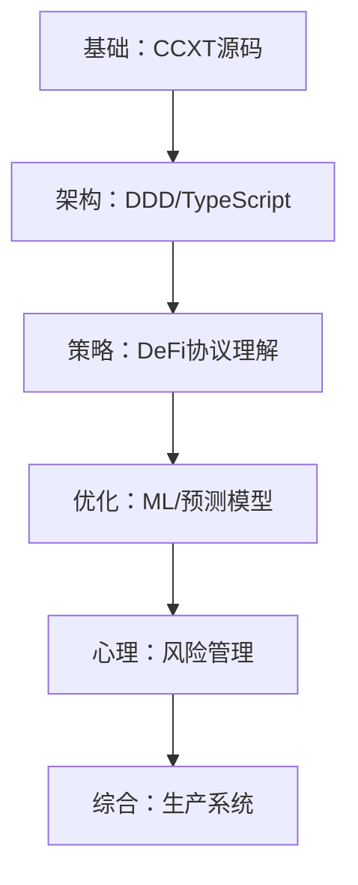

# 📚 深度研究资源清单 - 从代码到华尔街

## 1. 🧠 交易心理学与风险管理

### Chat With Traders
- **类型**: Podcast & Blog
- **核心价值**: 真实交易员访谈，学习顶级做市商的思维模式
- **关键收获**: 风险控制、心理管理、实战经验
- **应用场景**: 完善我们系统的风险管理模块

## 2. 🤖 AI/ML 金融应用

### Marcos Lopez de Prado
- **领域**: Financial Machine Learning
- **必读**: "Advances in Financial Machine Learning"
- **核心概念**:
  - 三重屏障标签法 (Triple Barrier Method)
  - 特征重要性分析 (MDI, MDA)
  - 去噪相关矩阵 (Denoising Correlation Matrices)
- **SSRN论文**: 工业级标准理论
- **系统整合**: 可以为我们的套利引擎添加 ML 预测层

### Hugging Face Blog
- **专长**: NLP/Transformer 模型
- **应用场景**:
  - 社交媒体情绪分析
  - 新闻事件交易
  - 链上数据文本挖掘
- **推荐模型**: FinBERT, CryptoBERT

## 3. 🌐 DeFi 深度研究

### Finematics
- **YouTube频道**: DeFi 协议可视化讲解
- **覆盖内容**:
  - AMM 数学原理
  - Impermanent Loss 计算
  - 流动性挖矿策略
  - 新协议机制分析
- **实战价值**: 快速理解新 DeFi 协议的套利机会

## 4. 💻 TypeScript 与系统架构

### Matt Pocock (Total TypeScript)
- **专长**: TypeScript 高级技巧
- **关键技术**:
  - 类型体操 (Type Gymnastics)
  - 品牌类型 (Branded Types) - 防止金额混淆
  - 穷举检查 (Exhaustive Checks)
- **系统应用**:
  ```typescript
  // 品牌类型示例 - 防止 USD 和 ETH 混淆
  type USD = number & { __brand: 'USD' };
  type ETH = number & { __brand: 'ETH' };
  ```

### Khalil Stemmler
- **领域**: DDD + TypeScript
- **核心概念**:
  - 值对象 (Value Objects)
  - 聚合根 (Aggregate Roots)
  - 仓储模式 (Repository Pattern)
- **架构价值**: 构建可扩展的交易系统领域模型

## 5. 🔧 实战代码库学习

### CCXT 源码研读
- **GitHub**: ccxt/ccxt
- **学习要点**:
  - 统一 API 抽象
  - Rate Limiting 实现
  - WebSocket 流处理
  - 错误重试机制
- **代码示例路径**:
  - `/js/base/Exchange.js` - 核心交易所基类
  - `/js/pro/` - WebSocket 实现

## 🎯 整合到我们的系统

### 第一阶段：强化现有系统
1. **风险管理升级** (Chat With Traders)
   - 添加最大回撤限制
   - 实现 Kelly Criterion 仓位管理

2. **ML 预测层** (Marcos Lopez de Prado)
   - 实现特征工程管道
   - 添加价格方向预测

3. **类型安全加强** (Matt Pocock)
   - 品牌类型防止金额错误
   - 穷举类型检查

### 第二阶段：新功能开发
1. **情绪分析模块** (Hugging Face)
   - Twitter/Reddit 情绪监控
   - 新闻事件交易信号

2. **DeFi 新策略** (Finematics)
   - JIT (Just-In-Time) 流动性
   - MEV-Boost 集成

3. **领域驱动重构** (Khalil Stemmler)
   - 交易领域模型
   - 事件溯源架构

## 📊 学习路径建议



## 🏆 终极目标

通过深入研究这些资源，我们的系统将进化为：

1. **技术层面**: 工业级代码质量 + ML 智能
2. **策略层面**: 全方位 DeFi 策略 + 情绪驱动
3. **风险层面**: 专业风控 + 心理管理
4. **架构层面**: DDD 清晰领域 + 事件驱动

这将不仅仅是一个交易系统，而是一个**具备自主学习和进化能力的金融 AI 平台**！

---

*"The best traders are not those who predict the future, but those who manage risk and adapt to change."*

最后更新：2025-12-01