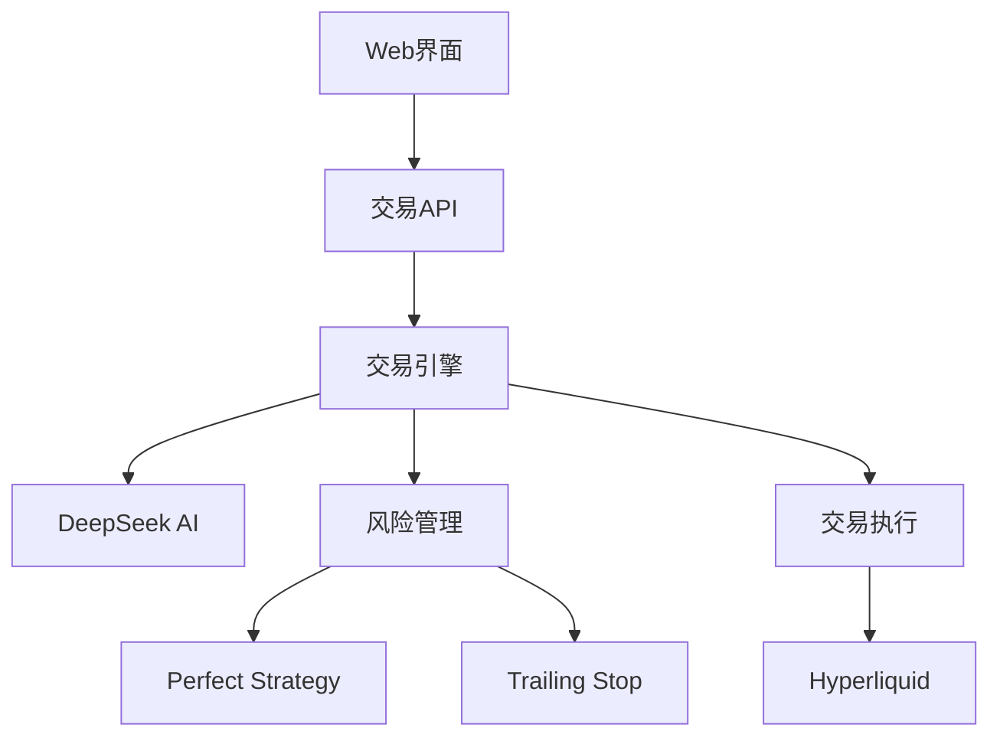

# Alpha Arena 交易系统 - 技术规格

## 🏗️ 系统架构

### 核心组件


## 📋 技术栈

| 组件 | 技术 | 版本 |
|------|------|------|
| 框架 | Next.js | 14.x |
| 语言 | TypeScript | 5.x |
| 运行时 | Node.js | 18+ |
| AI模型 | DeepSeek V3.1 | API |
| 交易所 | Hyperliquid | Testnet |
| 数据源 | CoinGecko | Free API |

## 🔧 配置参数

### 风险控制
```typescript
// 仓位控制
maxPositionPercent: 5%        // 单仓最大5%
maxLeverage: 3x              // 最大杠杆3倍
emergencyStopLoss: -3%       // 紧急止损3%
emergencyTakeProfit: 20%     // 紧急止盈20%

// 交易限制
maxDailyTrades: 10           // 每日最大交易次数
minOrderSize: $5             // 最小订单金额
```

### AI决策
```typescript
// DeepSeek API
model: "deepseek-v3"
costPerRequest: $0.0016      // 每次请求成本
timeout: 30s                 // API超时
retryCount: 3                // 重试次数
```

## 📊 监控指标

### 关键性能指标 (KPIs)
- **胜率**: >60%
- **最大回撤**: <15%
- **夏普比率**: >1.0
- **年化收益**: 目标20%+

### 系统指标
- **API响应时间**: <2s
- **决策延迟**: <500ms
- **系统可用性**: 99.9%
- **错误率**: <0.1%

## 🛡️ 安全设计

### 多层防护
1. **策略层**: AI决策验证
2. **系统层**: 独立风险检查
3. **执行层**: 订单验证
4. **紧急层**: 强制止损

### 访问控制
- API密钥隔离
- 测试网环境
- 无提现权限
- 日志审计

## 🔄 工作流程

### 交易周期 (3分钟)
```
1. 获取市场数据 (10s)
2. 计算技术指标 (5s)
3. AI决策生成 (30s)
4. 风险检查 (5s)
5. 执行交易 (10s)
6. 记录日志 (5s)
```

### 风险检查 (实时)
```
1. 仓位监控 (每30s)
2. 止损检查 (每次决策前)
3. Perfect Strategy (持续)
4. 紧急保护 (24/7)
```

## 📁 代码结构

### 文件组织
```
lib/
├── core/                    # 核心引擎
│   ├── tradingEngine.ts
│   └── realTradingExecutor.ts
├── strategies/              # 交易策略
│   ├── perfectTradingStrategy.ts
│   ├── gridTrading.ts
│   └── breakoutStrategy.ts
├── risk/                    # 风险管理
│   ├── trailingStopSystem.ts
│   └── riskCalculator.ts
├── integrations/            # 外部集成
│   ├── hyperliquidClient.ts
│   └── coingeckoClient.ts
└── utils/                   # 工具函数
    ├── indicators.ts
    └── logger.ts
```

### 数据模型
```typescript
interface Position {
  coin: Coin;
  side: 'LONG' | 'SHORT';
  entryPrice: number;
  size: number;
  leverage: number;
  entryTime: number;
  exitPlan?: ExitPlan;
  maxProfit?: number;
}

interface TradingDecision {
  action: 'buy_to_enter' | 'sell_to_enter' | 'close' | 'hold';
  coin: Coin;
  confidence: number;
  leverage: number;
  notional: number;
  exitPlan?: ExitPlan;
}
```

## 🔍 测试策略

### 单元测试
- 策略逻辑测试
- 风险计算测试
- API集成测试

### 集成测试
- 端到端交易流程
- 风险管理验证
- 错误处理测试

### 压力测试
- 高频交易模拟
- 极端市场条件
- 系统负载测试

## 📈 性能优化

### 响应时间优化
- API请求并行化
- 缓存机制
- 连接池复用

### 内存管理
- 定期垃圾回收
- 数据结构优化
- 内存泄漏监控

### 错误处理
- 优雅降级
- 自动重试
- 故障转移

## 🚀 部署配置

### 环境要求
```bash
Node.js: 18.0+
Memory: 2GB+
Storage: 10GB+
Network: 稳定网络连接
```

### 环境变量
```bash
DEEPSEEK_API_KEY=xxx
HYPERLIQUID_API_SECRET=xxx
HYPERLIQUID_MAIN_WALLET=xxx
HYPERLIQUID_TESTNET=true
```

### 启动命令
```bash
npm install
npm run build
npm run dev      # 开发模式
npm run start    # 生产模式
```

## 📝 维护指南

### 日常监控
- 检查系统日志
- 监控账户余额
- 验证交易执行
- 性能指标分析

### 定期维护
- 策略参数调优
- 风险限制更新
- 系统版本升级
- 安全审计

### 故障排查
1. 检查API连接状态
2. 验证环境变量配置
3. 查看错误日志
4. 测试网络连接

---

**版本**: v1.2  
**更新日期**: 2024年12月1日  
**维护者**: 开发团队